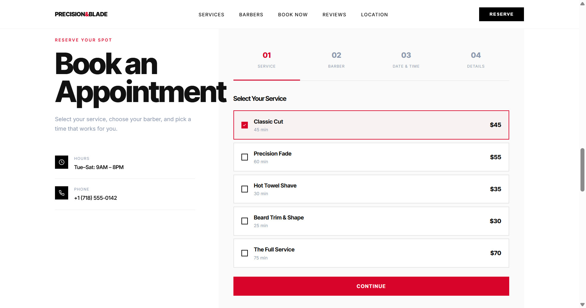
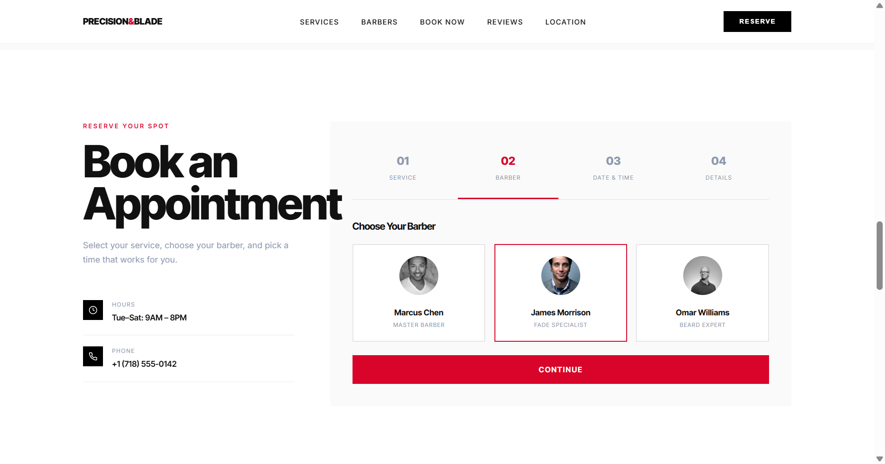
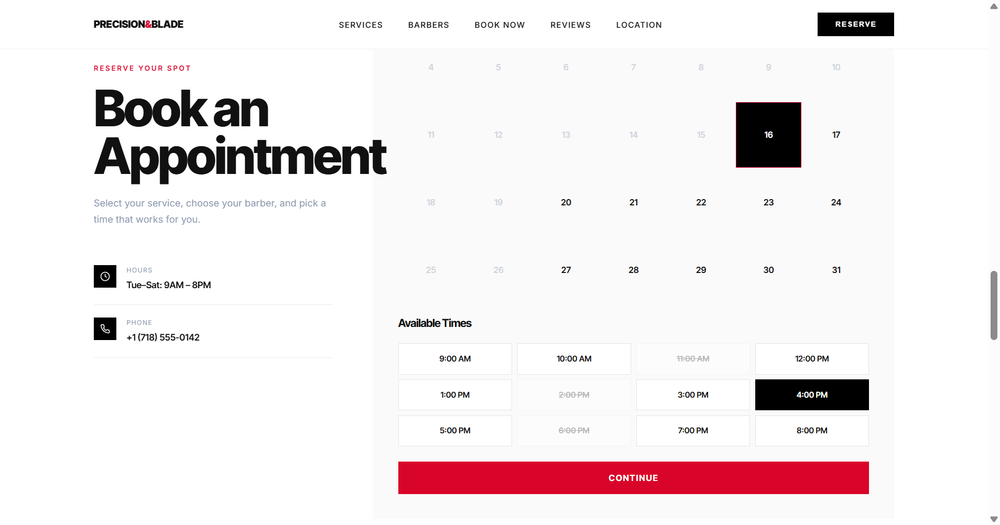
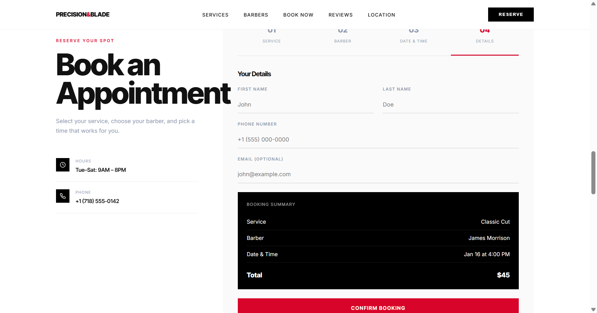

# Precision & Blade — Barber Studio

Static demo website for a barber studio created by an Agent AI.

## Overview

A single-page HTML/CSS/JS site showcasing services, team, booking flow (multi-step), calendar, time slots and a confirmation modal. Ready for light customization and static hosting.

## Features

- Responsive layout (desktop → mobile)
- Hero, marquee, services, barbers, booking, reviews, location, footer
- Booking flow with:
  - Service & barber selection
  - Calendar (disables past dates, Sundays & Mondays)
  - Time slot selection
  - Contact details and booking summary
  - Confirmation modal
- Pure client-side — no backend

## Live demo

The site is hosted and running at:  
https://krifiz.github.io/precision-and-blade/

## Screenshots

  
  
  
  

## Edit & Customize

- Modify text, images and prices directly in `precision-blade-barber.html`.
- Calendar / booking logic is in the inline `<script>` — adjust rules or integrate a backend as needed.
